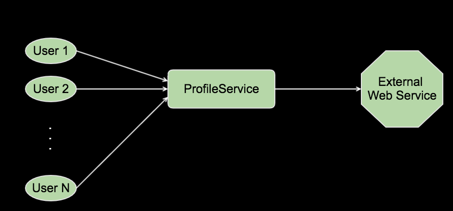

autoscale: true
build-lists: true


# Akka Circuit Breakers

## Alejandro Lujan

---


# Who Am I?

- Typesafe => Lightbend fan for ~6 years
  - Developer, Trainer, Mentor
  - Scala, Akka, Play, *Lagom*
-  Scala Up North organizer 
- Java dev / architect for 10 years
- Other stuff: C#, C++, <sub>PHP</sub>

---


# What we'll cover

- The problem with timeouts
- Circuit breaker basics
- Code samples

---

# Timeouts are hard



---

# Timeouts are hard


---

# The use case of Circuit breakers

- **This one call** is timing out
- Is this a one-time failure?
- Or a consistent issue?
- How do we keep track?
- Can we give the service a chance to recover before trying again?

---

# Our goal


---

# A code example

For readability, code slides won't have an image background

```scala
class ServiceActor() extends Actor with ActorLogging {

  override def receive: Receive = {
    case message =>
      log.info("Received this message: '{}', responding", message)
      sender() ! "response"
  }

}
```

---


# [fit] Thanks!

## Upcoming webinars:

- **October 21**: Akka Typed - Type Sanity for Your Actors

- **November 29**: CRDTs and Akka Distributed Data

## @Yopp_Works
## yoppworks.com/events
## info@yoppworks.com